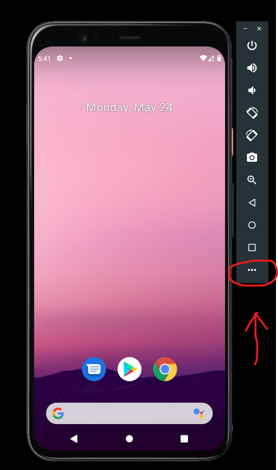
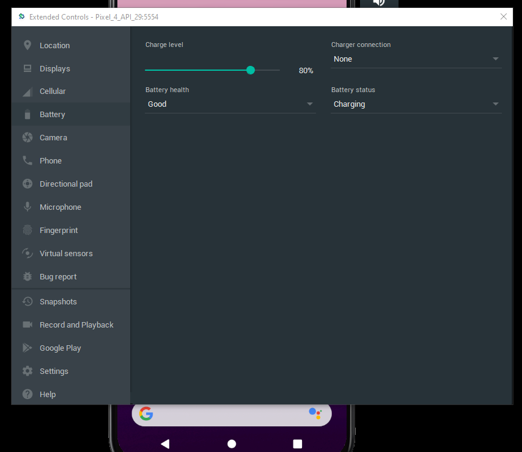

# Como acessar algumas funções do emulador
O emulador do Android Studio possui opções que permitem acessar determinadas funções do aparelho, 
como alterar valor da bateria, definir uma localização de GPS arbitrária, simular ligações, 
entre outras.
Para acessar essas funções, basta clicar na opção more (reticências ou três pontinhos), ao lado da 
tela do emulador, como na figura abaixo:

Na janela que aparecer, basta clicar nas opções no canto esquerdo para configurar o emulador. Veja
o exemplo das opções da bateria:

As alterações são feitas em tempo real (ou quase), não é necessário salvar.

## Bateria
Na aba Battery é possível alterar o nível de carga e se o telefone está carregando ou não.

## GPS
Na aba Location é possível definir a localização do aparelho e salvar pontos no mapa.

## Ligações
<<<<<<< Updated upstream
Na aba Phone é possível simular ligações e enviar SMS para o aparelho.
=======
Na aba Phone é possível simular ligações e enviar SMS para o aparelho.
>>>>>>> Stashed changes
