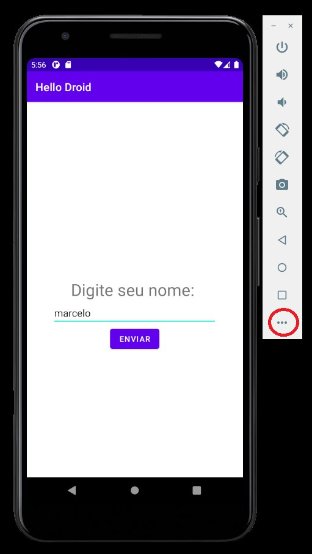
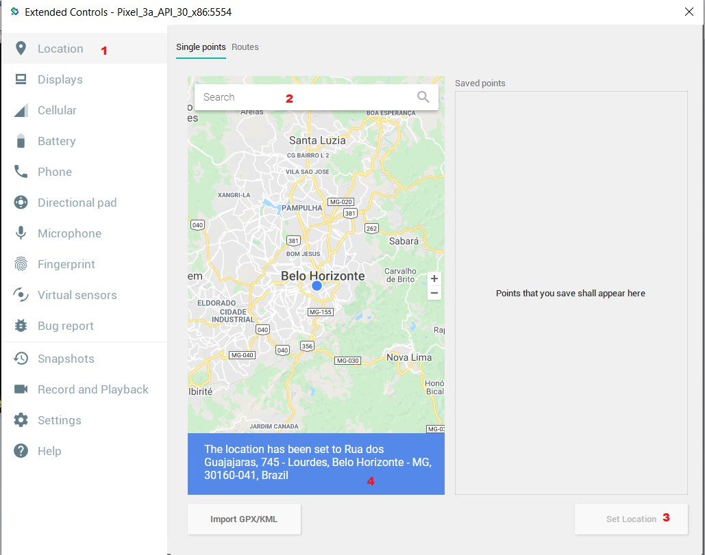
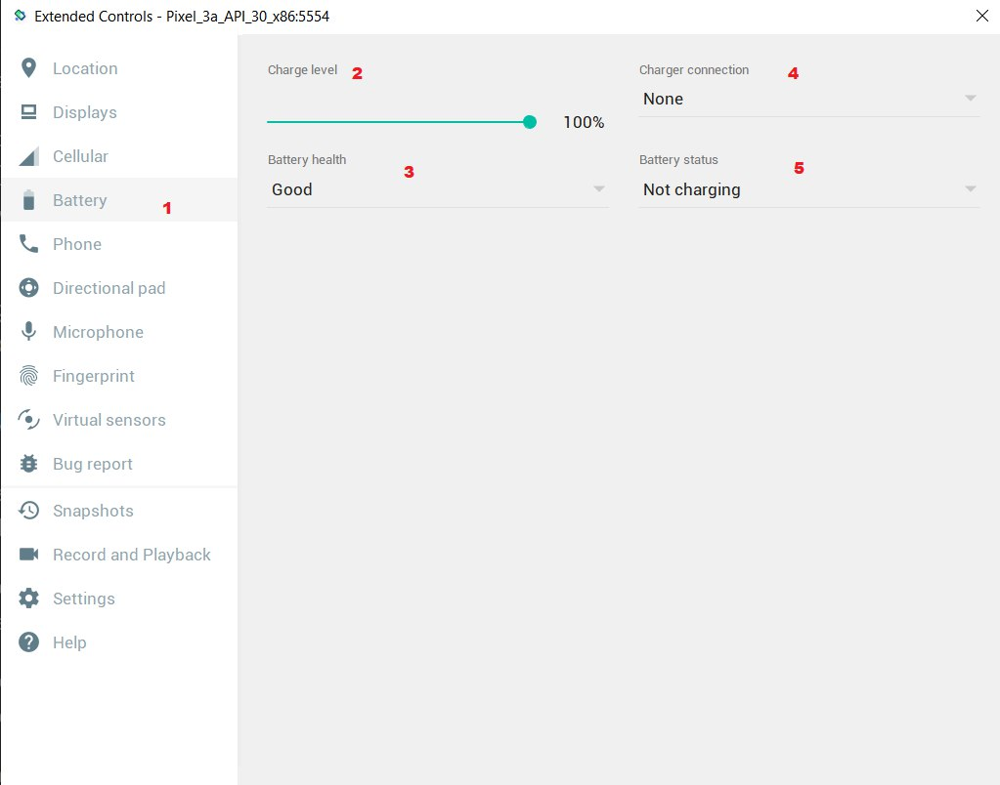
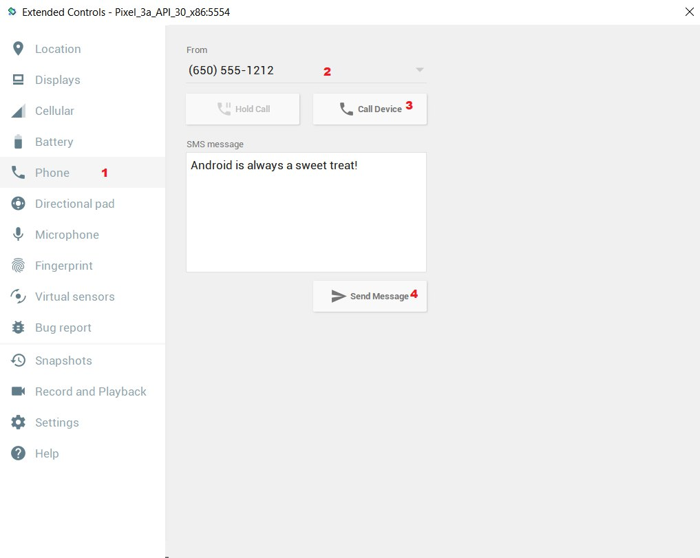

# GPS, bateria e ligações

Aluno: Marcelo Simim

# Como acessar

Para ter acesso às configuirações de gps, bateria e ligações basta clicar no botão assinalado em vermelhor na imagem abaixo. Irá abrir uma janela de configurações, cujo nome é Extended Controls.

# GPS

Para alterar a localização do dispositivos, basta seguir os passos mostrados na imagem abaixo: `

- 1: Clicar na opção Location
- 2: Buscar pela localização no campo de pesquisa Search, outra opção é fazer a busca pelo próprio mapa
- 3: Clicar em Set Location para definir a localização escolhida
- 4: Após isso, a mensagem indicando que a mudança foi feita irá aparecer

# BATERIA

Para alterar o estado da bateria do dispositivo, basta seguir os passos mostrados na imagem abaixo:

- 1: Clicar na opção Battery
- 2: Mexer para a direita ou esquerda para alterar a porcentagem da bateria
- 3: Alterar a saúde da bateria (boa, morta, desconhecida, etc)
- 4: Alterar a conexão do carregador (AC charger)
- 5: Alterar o status da bateria (carregando, cheia, descarregada, etc)

# LIGAÇÕES

Por fim, para alterar o estado da bateria do dispositivo, basta seguir os passos mostrados na imagem abaixo:

- 1: Clicar na opção Phone
- 2: Definir de qual o número o dispositivo irá receber a ligação/mensagem
- 3: Iniciar uma ligação com o dispositivo emulador. Após o clique, esse botão muda para o estado de finalizar ligação. O botão ao lado deixa a ligação em espera.
- 4: Enviar uma mensagem ao dispositivo emulador, sendo que essa pode ser alterada no campo de texto definido por SMS message.

# POR QUE USAR ESSES RECURSOS?
